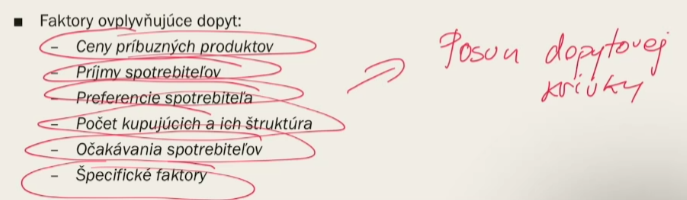
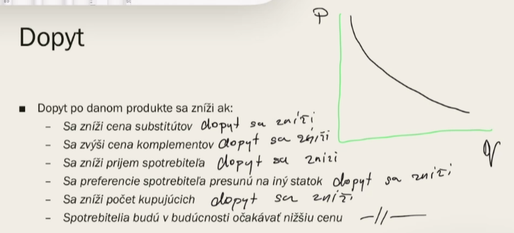
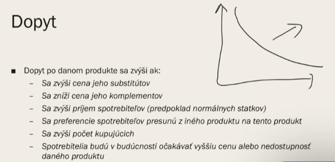
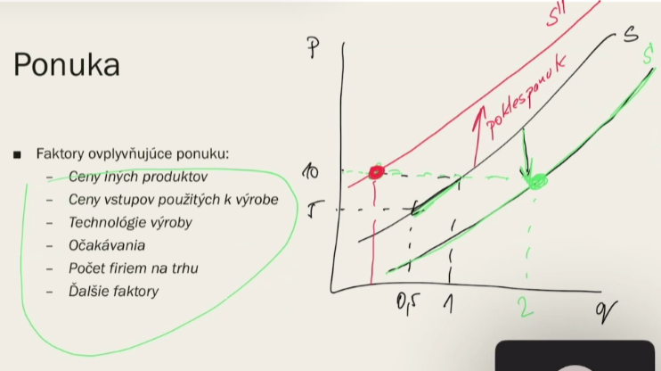
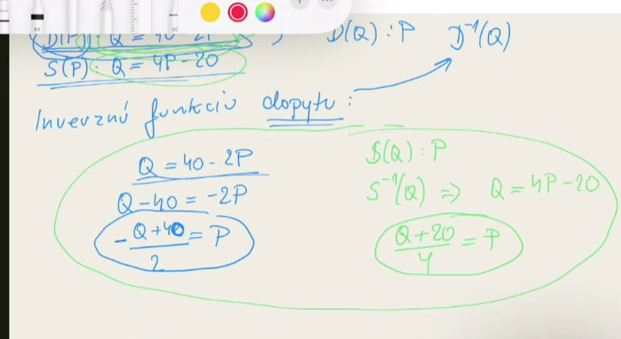
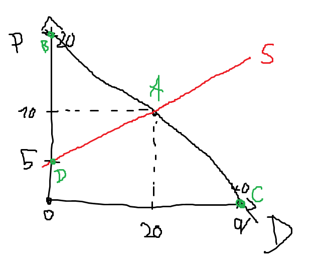
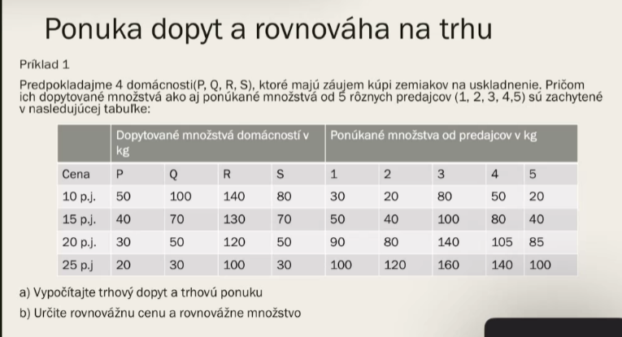

## dvaja na trhu 
- firma -> vytvara ponuku
- kupec -> vytvara dopyt

## individualny dopyt
- po jednom produkte, alebo dopyt jedneho kupcu

## Trhovy dopyt
- vsetkych spotrebytelov po jednom statku

## agregatny dopyt
- vsetkych spotrebitelov po vsetkych statkoch (npr. na urovni slovenksa = vsetci obyvatelia slovenksa po vsetkych statkoch) (toto je makro nie mikro preto to nebudeme riesit)

## Q = a - b*p
Q - pozadovany dopyt
a - (konstanta) ake je dopitovane mnozstvo ked cena je 0
p - cena
b - konstanta

## Dopyt
rast dopytu (ked krivka dopytu ide doprava)

pokles dopytu (ked krivka dopytu ide dolava)

posun po dopytovej krivke zavisi od zmeny ceny

Tieto faktory menia posun dopytovej krivky (bud rast alebo pokles doputy)

Dokonale substituty - statky ktore sa dokonale nahradzaju (npr. Milka == Figaro) ak zdrazi Figaor tak sa dopyt po Milke zvisi

Dokonale komplementy - jeden statok dokonale doplna ten druhy (cerealie + mlieko) ak jeden statok zdrazie tak aj druhy dopyt po statku klesne (lava a prava)

## Priklady:
znizovanie dopytu

zvysovanie dopytu (posun krivky doprava nnahor)

## Ponuka
- zakon punuky: za inak nezmenenych podmienok, s rastom ceny restie ponukane mnozstvo a s poklesom ceny ponukane mnozstvo klesa

jedine cena - zmena ponukaneho mnozstva

zmena ponuky - pokles / rast zavisi od ostatnych faktorov

TODO: sem este pridat tie ostatne priklady

## priklady:

- a)

D(P): Q = 40 - 2P

S(P): Q = 4P - 20

Postup pri takejto ulohe
1. vypocitat invers funkcie D a S (proste iba vyjadris P z nich)
2. das do rovnosti tie dve invers funkcie P = P 
3. vyjde ti bod rovnovahy trhu [Q, P]
4. dopocitas dalsie 2 body tak, ze do D(P) : Q = 0 => P = ?
potom D(0) : P = 0 => Q = ?   
5. spojis 3 body a mas D krivku
6. vypocitas S(P) : Q = 0 => P = ? a spojis tento bod a bod rovnovahy trhu [Q, P] a mas priamku S
---

1.

D^-1(P): P = 20 - Q/2

S^-1(P): P = Q/4 + 5

2. 

20 - Q/2 = Q/4 + 5

80 - 2Q = Q + 20

Q = 20

3.

P = 20 - 20/2

P = 10

A [20, 10]

4.

0 = 40 - 2P

P = 20

B [0, 20]

Q = 40 - 20*0

Q = 40

C [40, 0]

6.

0 = 4P - 20

P = 5

D [0, 5]

---
b)

D(P): Q = (500 - 5P)/(P + 20)

S(P): Q = (P - 25)/3

---
b.1) (dopocitat rovnovaznost so zmenenou S(P) a dokreslit do grafu)

S(P): Q = (P - 20)/2

# DU

