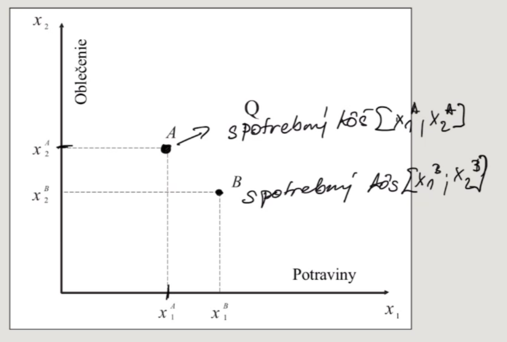
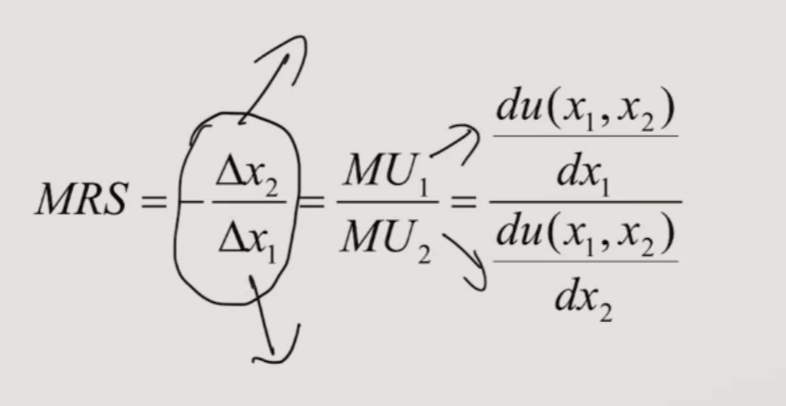

- miesto kde sa dopyt s ponukou stretava je rovnovaha
- Firma vytvara ponuky
- spotrebitelia vytvaraju dopyt
- vsetci sa snazia vytvarat optimalnu strategiu

# preferencie
## funkcia uzitocnosti
- u = u(x)
- u(x) - miera uspokojenia spotrebitela
- x - pristupne spotrebne strategie

- x = mam 10E ktore mozem minut
- u(x) = nieco za to miniem a mam za to nejaku mieru uspokojenia

### celkova uzitocnost (TU)
- reporezentuje a ukazuje ake celkove uspokojenie z urciteho tovaru

-spociatku rastuci charakter a potom klesa
- do urciteho stavu potom nastane nasytenie a kazde dalsie pridanie kusu klesa tato funkcia

### hranicna uzitocnost (MU)
- v celom priebehu klesajuca, kazdou dalsou jednotkou moja uzitocnost klesa
- vyjadruje o kolko sa 

v bodde kde je MU = 0 (dalsia dodatocna jednotka mi nic nepriniesla) je TU = max

## Vlastnosti funkcie uzitocnosti
- rastuca 

## [Nejaky nadpis]

- uplnost = vie porovnat vsetky alternativy medzi sebou
- reflexivnost = ak porovna jeden rovnaky statok 2x tak je rovnako dobry (dve jablka su rovnako dobre medzi sebou)
- nenasytenost = cim viac normalneho statku (statok beznej spotreby (chlieb, oblecenie, ...)) mam tak je to vzdy lepsie
    - ak preferujem A > B tak preferujem mat viac statkov A ako statkov B
- tranzitivnost = ak jednotlivec preferuje A > B a B > C tak A > C

# nakup dvoch tovarov

- ak spojim body A a B tak vieme zakreslit indiferencnu krivku
    - nesie info o spotrebnych kosoch

## Vlastnosti indiferencnych kriviek
- zaporny sklon
    - ak chcem viac statku x1 a chcem byt stale na rovnakej krivke (mat rovnaku uzitocnost u1) tak sa musim vzdat viac statku x2
- indifirencka mapa je husta
    - kazda ma svoju uzitocnost u (smerom nahor je uzitocnost vyssia)
    - kose na rovnakej krivke maju rovnaku uzitocnost
- rovnaky spotrebny kos nemoze priniest 2 rozne uzitocnosti
- indiferencne krivky sa nepretinaju

## hranicna miera spotrebitelskej substitucie
- MRS = -delta x2/delta x1

- sklon krivky
- kolko sa musi zmenit x2 ked chcem zmenit x1 a ostat na rovnakej krivke

# Specificke tvary indiferencncyh kriviek

# IDK uz to nedavam - asi Rozpoctove ohranicenie

- R - dochodok, rozpocet
- p - price
- x - produkt

## zmena rozpoctoveho ohranicenia

spojenie preferencii + rozpoctove ohranicenie = optimalna strategia

1. cielom postrebitela = maximalizacia uzitocnosti
2. moznosti spotrebitela = rozpoctove ohranicenie

.
.
.

miesto dotyku krivky a ohranicenia - miesto kde sa rovnajnu sklony
sklon rozpoctovej priamky = - p1/p2
sklon klivky = MRS

- -p1/p2 = MRS = -delta x2/delta x1 = MU1/MU2 = ....

# Analyza spotrebitelskeho dopytu

- zmena dochodku = dochodkovy efekt
    - ako zmena ceny ovplyvnuje realny prijem
- substitucny efekt
    - ako zmena ceny ovplyvnuje moj vyber statkov

# Elasticita dopytu
- 3 typy
    - cenova elasticita
        - (toto nie je doplnene)
    - dochodkova elasticita
        - (toto nie je doplnene)
    - krizova elasticita
        - dopyt po x1 ked sa zmeni cena x2
        - vieme urcit ci su statky nezavysle/substitucne/komplemeny

