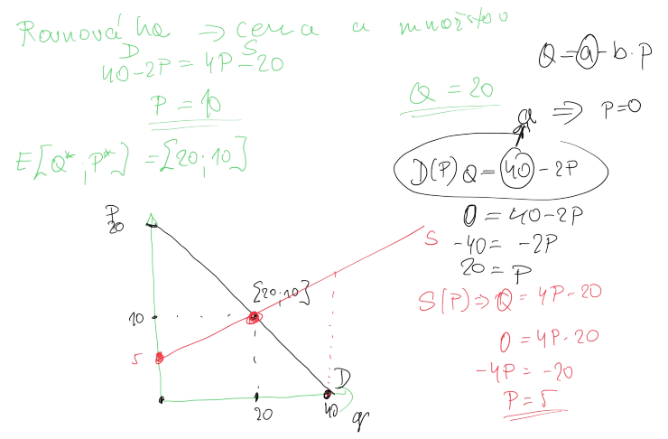
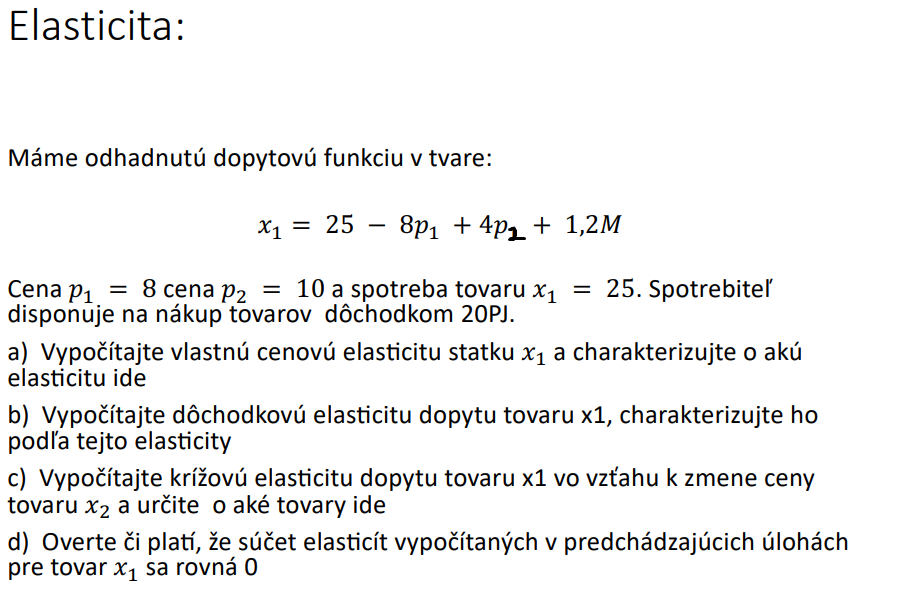

# Tieto temy pisala ze sme preberali tak ku nim pridam priklady ktore sme pocitali a trocha teorie + vzorce ak najdem

dopytové krivky a ponukové (ich posuny), rovnováha na trhu, elasticita dopytu, rozpočtové ohraničenie spotrebiteľa, indiferenčné krivky, rovnováha spotrebiteľa, produkčná analýza s jedným variabilným faktorom, nákladovové krivy, minimalizácia nákladov.

--- 
## dopytové krivky a ponukové (ich posuny)
### Dopyt
- Zákon dopytu:
Za inak nezmenených podmienok (ceteris paribus), sa bude rastom ceny dopytovaného
množstva znižovať a naopak, pri poklese ceny sa bude dopytované množstvo zvyšovať.

#### Posun celej krivky 
- Ak pri rovnakej cene dochádza k zmene dopytovaného množstva môžeme
hovoriť o zmene dopytu a teda dochádza k posunu celej dopytovej krivky
#### Posun po krivke
- Ak dochádza pri zmene ceny aj k zmene dopytovaného množstva vtedy ide o
posun po dopytovej krivke.

### Ponuka
- Zákon ponuky:
Za inak nezmenených podmienok (ceteris paribus), s rastom ceny rastie ponúkané
množstvo a s poklesom ceny ponúkané množstvo klesá. 

#### Posun celej krivky 
- V prípade ak pri rovnakej cene je vyrábané väčšie resp. menšie množstvo daného
statku budeme hovoriť o zmene ponuky – posun krivky ponuky
#### Posun po krivke
- V prípade ak dôjde k zmene ceny za inak nezmenených okolností, potom táto zmena
ceny vyvolá posun po krivke ponuky a poôjde o zmenu ponúkaného množstva. 

## rovnováha na trhu

## elasticita dopytu

## rozpočtové ohraničenie spotrebiteľa

## indiferenčné krivky
### Vlastnosti
- Indiferenčné krivky sa nepretínajú
- Indiferenčná mapa je hustá
- Záporný sklon

## rovnováha spotrebiteľa
- usiluje sa maximalizovat svoju uzitocnost
- vyuziva taku strategiu aku si moze dovolit

## produkčná analýza s jedným variabilným faktorom
- Celkový produkt variabilného vstupu (TP)
- Marginálny (hraničný) produkt variabilného vstupu (MP)
- Priemerný produkt variabilného vstupu (AP)

### toto je asi s dvomi ale pristotu to tu vypocitam

## nákladové krivky (toto radsej skip strasne je vela teorie a ziadne priklady)
- TC = FC + VC
    - TC = celkove naklady
    - FC = fixne naklady
    - VC = variabilne naklady
- AC = TC / Q
    - AC = Priemerne naklady
    - Q = mnozstvo produkcie
- MC = ΔTC / ΔQ
    - MC = hranicne naklady

1. Krivka priemerných nákladov (AC) a priemerných variabilných nákladov (AVC) má tvar písmena "U".
2. Krivka hraničných nákladov (MC) pretína krivku AC a AVC v ich minimálnych bodoch.

## minimalizácia nákladov

