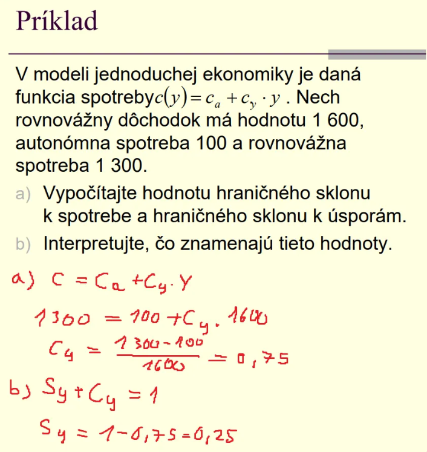
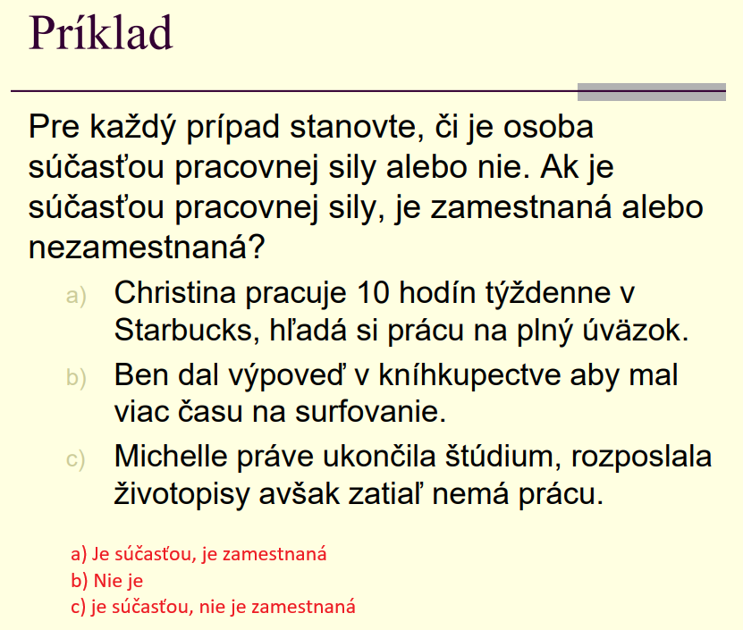

HDP

- nominálny GDP sa môže zmeniť, ak
dochádza k rastu cien, ale vyrobené
množstvá sa nemenia

- reálny gdp je upravený o zmeny vo
všeobecnej hladine cien

- na defláciu sa používa všeobecná cenová
hladina (cenový index)
- cenovým indexom pre GDP je GDP deflátor

## GDP prostrednictvom vydavkov

## GDP prostrednictvom pridanej hodnoty

## GDP prostrednictvom prijmov

## Potenciálny GDP

- určuje, akú hodnotu môže ekonomika
vyprodukovať, ak sú pracovné zdroje, stroje a
zariadenia zamestnané / využívané na
normálnej úrovni

## Identita GDP

hovori o rovnosti GDP

GPD vydavkov = GDP prijmov 

# 3 typy ekonomiky

1. otvorena ekonomika
    
    
    
2. uzavretá ekonomika (bez vztahov so zahranicim)
    
    
    
    Investivie = savings + (taxes - government)
    
3. jednoduchá
    
    
    
    investicie = savings
    

# Model jednoduchej ekonomiky

- **y**: Celkový ekonomický výstup alebo príjem krajiny (hrubý domáci produkt, HDP).
- **c**: Spotreba domácností.
- **i**: Investície (exogénne, nezávislé od úrovne príjmu).
- **ca**: Autonómna spotreba – základná spotreba domácností, ktorá je nezávislá od úrovne príjmu. Ide o nevyhnutné výdavky (ako potraviny, energie atď.), ktoré ľudia vynakladajú aj pri nulovom príjme.
- **cy**: Hraničný sklon k spotrebe – predstavuje časť dodatočného príjmu, ktorú domácnosti spotrebujú. Napríklad, ak cy=0.8, tak domácnosti spotrebujú 80 % každého dodatočného eura, ktoré zarobia.

# Model uzavretej ekonomiky

- g: vladne vydavky
- yd: disponibilny dochodok (dochodok ktory zostal po zaplateni dani)
- t: paušálna daň

# Hospodársky cyklus

- obdobie rastu (oživenie) reálneho hdp
- obdobie stagnácie a poklesu (recesie) reálneho hdp
- depresia - niekoľkoročný nepretržitý pokles reálneho gdp

## Inflácia

## Indexy spotrebitelskych cien

## Nezamestnanost a pracovna sila

- nezamestnaní – tí ľudia bez práce, ktorí si ju aktívne hľadajú
- pracovná sila = zamestnaní + nezamestnaní 

### Miera nezamestnanosti

- nezamestnani ludia ako percento z celkovej pracovnej sily

# Priklady prednasky

---

- a) + d)

- b)  Pre výrobu 40 jednotiek tovarov je dostupných 70 jednotiek služieb, zatiaľ čo pre výrobu 50 jednotiek tovarov klesne výroba služieb na 65 jednotiek. Alternatívne náklady 10 ďalších jednotiek tovarov sú teda strata 5 jednotiek služieb.
- c) Princíp rastúcich alternatívnych nákladov je v PPF znázornený postupným zakrivením hranice. Čím viac sa krajina špecializuje na výrobu jedného typu tovaru (tovary), tým väčší objem služieb musí obetovať na získanie ďalších jednotiek tovarov. Tento jav je viditeľný v tvare PPF, ktorá nie je priamka, ale zakrivená krivka.

---

- c) cenová hladina v Japonsku bola v tomto období stabilná a nízka v porovnaní s bázickým rokom, pričom v roku 2008 nastalo mierne zvýšenie.

# Priklady cvičenie

je to v zošite