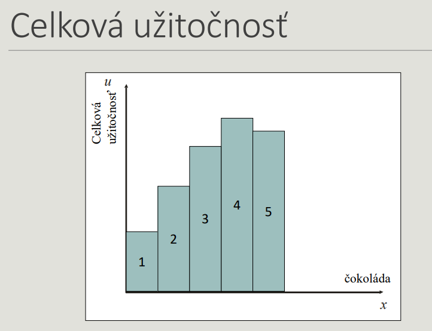
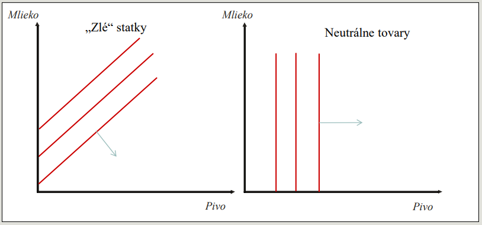
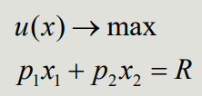
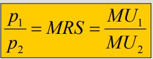
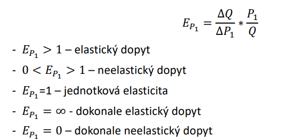
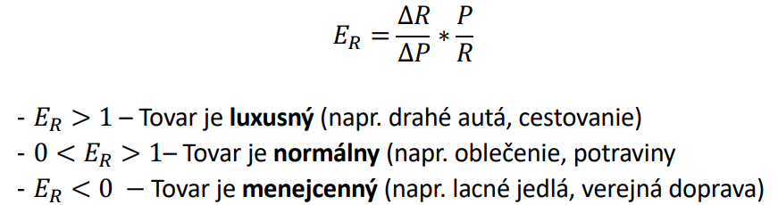
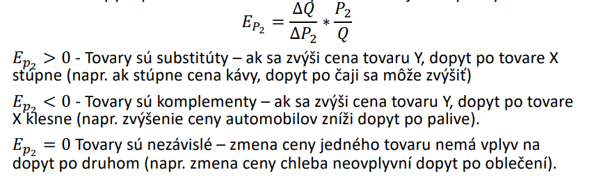
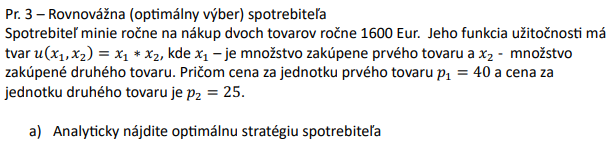
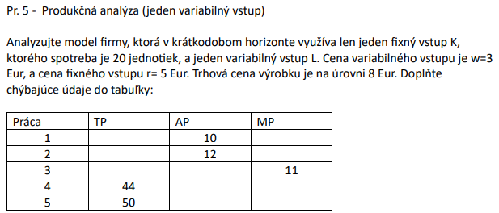
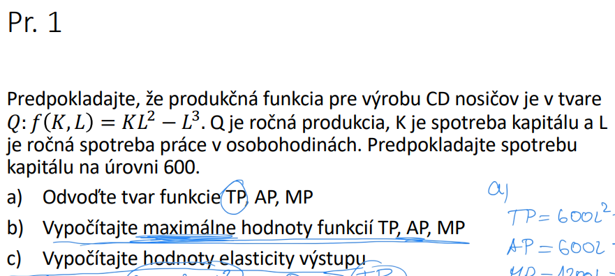

# Trocha teorie a vzorce

## Funkcia uzitocnosti
u = u(x)

## Sklon indiferenckej krivky - MRS

## Specialne tvary indiferencnych kriviek

## Rozpoctove ohranicenie

- x = mnozstvo tovaru
- p = cena tovaru

### Zmena ohranicenie
- Ked sa zvysi R tak sa posunie cela krivka hore doprava
- Ak sa znizi cena jedneho tovaru tak ho vieme nakupit viac 

## Rovnovazna strategia spotrebitela
- usiluje sa maximalizovat svoju uzitocnost
- vyuziva taku strategiu aku si moze dovolit

### Optimalny spotrebny kos
- spotrebitel si voli taku kombinaciu tovarov, pre ktoru plati, rovnost sklonu rozpoctoveho ohranicenia (p1/p2) = sklonu indiferencnej krivky = MRS = MU1/MU2

## Elasticita
### Cenova

### Dochodkova

### Krizova

## Firma (netusim co to kurva)

### celkopvy produkt prace

### Hranicny produkt variabilneho vstupu

### Premerny produkt variabilneho vstupu

### Vzthay medzi funkciami celkoveho, hranicneho a priemerneho

### Elasticita produkcie (??? IDK)

## Nieco ine ale netusim co 

# Priklady a riesenia (Cvicenia)

# Priklady a riesenia (Prednasky)

